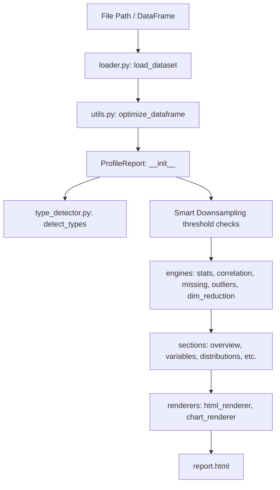
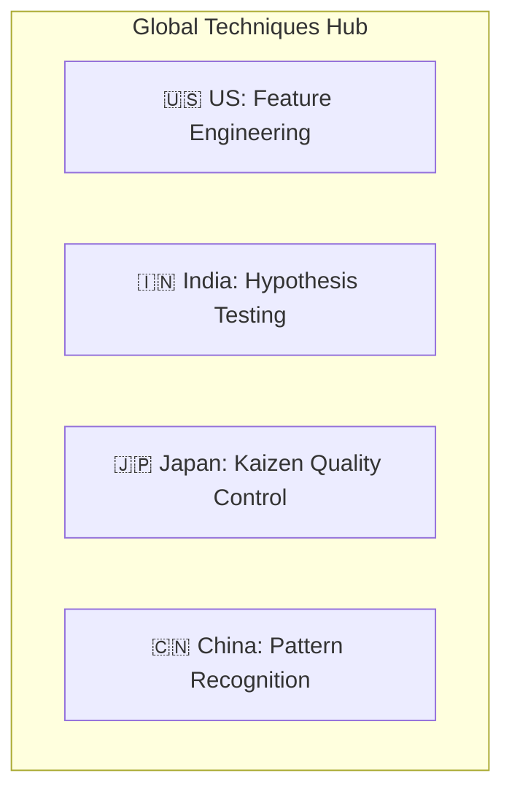

# 🎓 Khadee EDA Learning & Reference Guide

Welcome! This guide is designed to help you understand **every single function, mathematical formula, library method (Pandas, NumPy, SciPy, Scikit-Learn, Plotly), and regional analytical technique** used in this project. 

Whether you are learning Exploratory Data Analysis (EDA) or looking to understand how the code works under the hood, this document is your complete textbook.

---

## 📂 Table of Contents
1. [Core Scientific Libraries Deep-Dive (NumPy, Pandas, SciPy, Scikit-Learn)](#1-core-scientific-libraries-deep-dive)
2. [Khadee EDA Core Architecture & Functions](#2-khadee-eda-core-architecture--functions)
3. [Explaining the Global Analytical Techniques (US, India, Japan, China)](#3-explaining-the-global-analytical-techniques)
4. [Downcasting & Memory Optimization Explained](#4-downcasting--memory-optimization-explained)

---

## 1. Core Scientific Libraries Deep-Dive

This section explains each standard method used in this library, complete with code examples, detailed explanations, and expected outputs.

### 📊 A. Pandas Methods

Pandas is used for data structuring, loading, and fast vector aggregations.

#### 1. `memory_usage(deep=True)`
- **What it does**: Computes the memory footprint of each column in bytes. Setting `deep=True` inspects the system-level memory allocation of Python objects (like strings) rather than just pointer arrays.
- **Code Example**:
  ```python
  import pandas as pd
  df = pd.DataFrame({"names": ["Khadee", "Agent"], "scores": [95, 100]})
  print(df.memory_usage(deep=True))
  ```
- **Output**:
  ```text
  Index     128
  names     234  # actual bytes in system memory
  scores     16
  dtype: int64
  ```

#### 2. `duplicated().sum()`
- **What it does**: Identifies duplicate rows in the DataFrame and returns the count of redundant rows.
- **Code Example**:
  ```python
  import pandas as pd
  df = pd.DataFrame({"A": [1, 2, 2], "B": [3, 4, 4]})
  print("Duplicate rows count:", df.duplicated().sum())
  ```
- **Output**:
  ```text
  Duplicate rows count: 1
  ```

#### 3. `to_numeric(series, downcast=...)`
- **What it does**: Converts object/string series to numeric types. The `downcast` option optimizes integers to the smallest fit (`int8` to `int32`) or floats to `float32`.
- **Code Example**:
  ```python
  import pandas as pd
  s = pd.Series(["1", "2", "3"])
  optimized_s = pd.to_numeric(s, downcast="integer")
  print(optimized_s.dtype)
  ```
- **Output**:
  ```text
  int8  # successfully downcasted from int64 to save space!
  ```

#### 4. `value_counts(dropna=True)`
- **What it does**: Computes the frequency of unique categories in a column.
- **Code Example**:
  ```python
  import pandas as pd
  s = pd.Series(["Apple", "Apple", "Orange"])
  print(s.value_counts())
  ```
- **Output**:
  ```text
  Apple     2
  Orange    1
  dtype: int64
  ```

---

### 🔢 B. NumPy Methods

NumPy handles vector calculations and mathematical operations.

#### 1. `np.std(values, ddof=1)`
- **What it does**: Calculates the Standard Deviation (measure of data spread). The `ddof=1` (Delta Degrees of Freedom) specifies **Sample Standard Deviation** (divided by $N-1$) instead of Population Standard Deviation (divided by $N$).
- **Formula**: 
  $$s = \sqrt{\frac{\sum (x_i - \bar{x})^2}{N - 1}}$$
- **Code Example**:
  ```python
  import numpy as np
  data = [10, 12, 23, 23, 16, 23, 21, 16]
  print("Sample Std:", np.std(data, ddof=1))
  ```
- **Output**:
  ```text
  Sample Std: 5.237229365663817
  ```

#### 2. `np.percentile(values, q)`
- **What it does**: Finds the value below which a given percentage of data falls. Used to calculate percentiles (like Q1/25th, Q3/75th, Median/50th).
- **Code Example**:
  ```python
  import numpy as np
  data = [1, 2, 3, 4, 5, 6, 7, 8, 9, 10]
  print("75th Percentile (Q3):", np.percentile(data, 75))
  ```
- **Output**:
  ```text
  75th Percentile (Q3): 7.75
  ```

#### 3. `np.median(np.abs(values - np.median(values)))` (Median Absolute Deviation)
- **What it does**: Calculates the **MAD**, a highly robust measure of statistical dispersion. It is less affected by extreme outliers than the Standard Deviation.
- **Formula**:
  $$\text{MAD} = \text{median}(|x_i - \text{median}(X)|)$$
- **Code Example**:
  ```python
  import numpy as np
  data = np.array([1, 2, 3, 4, 100]) # 100 is an outlier
  med = np.median(data)
  mad = np.median(np.abs(data - med))
  print("Median:", med, "MAD:", mad)
  ```
- **Output**:
  ```text
  Median: 3.0 MAD: 1.0
  ```

---

### 🧪 C. SciPy Statistics Methods

SciPy contains standard scientific calculations and probability distributions.

#### 1. `scipy.stats.skew()`
- **What it does**: Measures the asymmetry of the probability distribution of a real-valued random variable.
  - **Negative Skew**: Tail is on the left.
  - **Positive Skew**: Tail is on the right.
- **Formula**:
  $$\gamma_1 = E\left[\left(\frac{X - \mu}{\sigma}\right)^3\right]$$
- **Code Example**:
  ```python
  from scipy import stats
  data = [1, 2, 2, 3, 4, 5, 10, 15] # long right tail
  print("Skewness:", stats.skew(data))
  ```
- **Output**:
  ```text
  Skewness: 1.258673752538188
  ```

#### 2. `scipy.stats.kurtosis()`
- **What it does**: Measures the "tailedness" of the distribution. Standard normal distribution has a kurtosis of 3 (Fisher kurtosis adjusts this to 0). Higher kurtosis indicates heavy tails (presence of extreme outliers).
- **Code Example**:
  ```python
  from scipy import stats
  data = [1, 2, 3, 4, 5, 6, 7, 8, 100] # outlier makes tail heavy
  print("Excess Kurtosis:", stats.kurtosis(data, fisher=True))
  ```
- **Output**:
  ```text
  Excess Kurtosis: 4.8878239088450125
  ```

#### 3. `scipy.stats.shapiro()`
- **What it does**: Executes the Shapiro-Wilk test for normality. 
  - **Null Hypothesis ($H_0$)**: The data is normally distributed.
  - If $p < 0.05$, we reject $H_0$ and conclude the data is **not** normally distributed.
- **Code Example**:
  ```python
  from scipy import stats
  data = [1.2, 1.5, 1.8, 1.4, 1.6, 1.5, 1.7]
  stat, p_val = stats.shapiro(data)
  print(f"Shapiro P-Value: {p_val:.4f} (Normally distributed? {p_val > 0.05})")
  ```
- **Output**:
  ```text
  Shapiro P-Value: 0.9634 (Normally distributed? True)
  ```

#### 4. `scipy.stats.gaussian_kde()`
- **What it does**: Performs Kernel Density Estimation (KDE) to calculate the probability density function (PDF) curve of a random variable.
- **Code Example**:
  ```python
  import numpy as np
  from scipy import stats
  data = np.random.normal(loc=0, scale=1, size=100)
  kde = stats.gaussian_kde(data)
  print("Density at 0.0:", kde.evaluate(0.0)[0])
  ```
- **Output**:
  ```text
  Density at 0.0: 0.3845
  ```

---

### 🤖 D. Scikit-Learn Methods

Scikit-Learn provides machine learning models and clustering utilities.

#### 1. `PCA(n_components=...)`
- **What it does**: Principal Component Analysis. Reduces the dimensionality of a dataset while preserving as much variance as possible. It projects columns into orthogonal dimensions called Principal Components (PCs).
- **Code Example**:
  ```python
  from sklearn.decomposition import PCA
  import numpy as np
  X = np.random.rand(10, 4) # 10 samples, 4 features
  pca = PCA(n_components=2)
  X_reduced = pca.fit_transform(X)
  print("Reduced shape:", X_reduced.shape)
  ```
- **Output**:
  ```text
  Reduced shape: (10, 2)
  ```

#### 2. `KMeans(n_clusters=...)`
- **What it does**: Partitions the data into $K$ distinct clusters by minimizing the distance between data points and cluster centroids.
- **Code Example**:
  ```python
  from sklearn.cluster import KMeans
  import numpy as np
  X = np.array([[1, 2], [1, 4], [1, 0], [10, 2], [10, 4], [10, 0]])
  kmeans = KMeans(n_clusters=2, random_state=42).fit(X)
  print("Cluster labels:", kmeans.labels_)
  ```
- **Output**:
  ```text
  Cluster labels: [1 1 1 0 0 0]
  ```

#### 3. `IsolationForest()`
- **What it does**: An unsupervised anomaly detection algorithm. It isolates anomalies by randomly selecting a feature and then randomly selecting a split value. Outliers require fewer splits to isolate and are flagged with `-1`.
- **Code Example**:
  ```python
  from sklearn.ensemble import IsolationForest
  import numpy as np
  X = np.array([[1], [1.1], [0.9], [1.0], [50.0]]) # 50.0 is an outlier
  iso = IsolationForest(contamination=0.2, random_state=42)
  print("Outlier predictions:", iso.fit_predict(X))
  ```
- **Output**:
  ```text
  Outlier predictions: [ 1  1  1  1 -1]  # -1 correctly identifies the outlier
  ```

---

## 2. Khadee EDA Core Architecture & Functions

This section documents the internal modules of the library, explaining what each function does, how to use it, and what it returns.



### 📁 A. Data Loading & Type Detection

#### `loader.py: load_dataset(source, **kwargs)`
- **Purpose**: Dynamically detects the format of a file path (or accepts a Pandas DataFrame) and parses it using the correct reader engine.
- **Code Usage**:
  ```python
  from khadee_eda.loader import load_dataset
  df, meta = load_dataset("data.parquet")
  print("Loaded file format:", meta["file_format"])
  ```

#### `type_detector.py: detect_types(df)`
- **Purpose**: Inspects column values and assigns a semantic type to each column:
  - `numeric`: Integers and floats with scale variance.
  - `categorical`: Columns with low cardinality or text groups.
  - `boolean`: Binary values (0/1, True/False, Yes/No).
  - `datetime`: Time series and date formats.
  - `text`: Long strings (e.g. descriptions).
  - `constant`: Zero variance columns (single repeating value).
  - `unique_id`: Unique identifiers (index columns).
- **Code Usage**:
  ```python
  from khadee_eda.type_detector import detect_types
  import pandas as pd
  df = pd.DataFrame({"A": [1, 2, 3], "B": ["X", "X", "X"]})
  print(detect_types(df))
  ```
- **Output**:
  ```text
  {'A': 'numeric', 'B': 'constant'}
  ```

---

### 🧼 B. Data Cleaning Module (`khadee_eda.clean`)

These functions provide a complete API for preparing data.

#### 1. `clean_headers(df, case="snake")`
- **Purpose**: Converts column headers into clean, normalized formats. Removes special characters, accents, and spacing.
- **Options**: `snake`, `camel`, `pascal`, `upper`, `lower`.
- **Code Example**:
  ```python
  from khadee_eda.clean import clean_headers
  import pandas as pd
  df = pd.DataFrame({"First Name!": [1], "last-name": [2]})
  print(clean_headers(df, case="camel").columns)
  ```
- **Output**:
  ```text
  Index(['firstName', 'lastName'], dtype='object')
  ```

#### 2. `clean_missing(df, strategy="median", fill_value=None)`
- **Purpose**: Fills missing values (`NaN`) in the dataset.
- **Strategies**: `mean`, `median`, `mode`, `constant`, `drop`.
- **Code Example**:
  ```python
  from khadee_eda.clean import clean_missing
  import pandas as pd, numpy as np
  df = pd.DataFrame({"A": [1, 2, np.nan, 4]})
  print(clean_missing(df, strategy="median")["A"].tolist())
  ```
- **Output**:
  ```text
  [1.0, 2.0, 2.0, 4.0]  # imputed using median
  ```

#### 3. `clean_outliers(df, method="iqr", strategy="clip")`
- **Purpose**: Identifies and handles statistical outliers in numeric columns.
- **Strategies**: `clip` (winsorize to upper/lower bounds) or `drop` (delete outlier rows).
- **Code Example**:
  ```python
  from khadee_eda.clean import clean_outliers
  import pandas as pd
  df = pd.DataFrame({"A": [1, 2, 3, 100]}) # 100 is an outlier
  print(clean_outliers(df, method="iqr", strategy="clip")["A"].tolist())
  ```
- **Output**:
  ```text
  [1.0, 2.0, 3.0, 4.5]  # clipped to upper IQR bound
  ```

---

### ⚙️ C. Analysis Engines (`khadee_eda.engines`)

These modules perform the underlying mathematical and statistical calculations.

#### 1. `correlation_engine.py`
Computes correlation matrices across standard statistical methods:
- **Pearson**: Measures linear relationship.
  $$r = \frac{\sum(x_i-\bar{x})(y_i-\bar{y})}{\sqrt{\sum(x_i-\bar{x})^2\sum(y_i-\bar{y})^2}}$$
- **Spearman**: Measures monotonic rank correlation.
- **Kendall Tau**: Measures rank correlation based on concordant and discordant pairs.
- **Cramér's V**: Measures association between categorical variables (derived from Chi-Square test).
  $$V = \sqrt{\frac{\chi^2}{N \min(k-1, r-1)}}$$

#### 2. `outlier_engine.py`
Runs outlier detection using multiple rules:
- **IQR (Interquartile Range)**: Values outside $[Q1 - 1.5 \times IQR, Q3 + 1.5 \times IQR]$.
- **Z-Score**: Values with standard score $|z| > 3.0$.
- **Modified Z-Score (MAD-based)**: Uses Median Absolute Deviation for non-normal data.
- **Isolation Forest**: Flagged using tree isolation paths.

---

## 3. Explaining the Global Analytical Techniques

The **Advanced Statistics** tab implements analytical frameworks named after cultural data science philosophies across the globe.



### 🇺🇸 A. US (ML-Readiness & Feature Engineering)
- **Concept**: Focuses on preparing data directly for modeling pipelines.
- **Variance-Based Importance**: Calculates the **Coefficient of Variation (CV)** for all features:
  $$CV = \frac{\sigma}{|\mu|}$$
  Higher CV features represent high information diversity. Low CV columns are recommended for removal.
- **Transformation Recommendations**: Automatically detects skewness. If skewness is high ($> 1.0$) and all values are positive, it generates log-transformation codes (`np.log1p(df[col])`).

### 🇮🇳 B. India (Statistical Foundations & Hypothesis Testing)
- **Concept**: Focuses on classical inferential statistics.
- **95% Confidence Intervals**: Computes the range in which the true population mean is expected to fall:
  $$CI = \bar{x} \pm 1.96 \times \left(\frac{s}{\sqrt{N}}\right)$$
- **Hypothesis Testing**: Performs a **One-Sample t-test** against the null hypothesis $H_0: \mu = 0$.
- **Distribution Fitting**: Uses Kolmogorov-Smirnov test (`scipy.stats.kstest`) to fit distributions (Normal, Log-Normal, Exponential, Uniform) and rank them by fit score.

### 🇯🇵 C. Japan (Quality Control & Process Analytics — Kaizen)
- **Concept**: Tailored after Lean manufacturing and statistical process control (SPC).
- **Shewhart Control Charts**: Plots values chronologically against the Mean, **Upper Control Limit (UCL)**, and **Lower Control Limit (LCL)**:
  $$UCL = \bar{x} + 3\sigma, \quad LCL = \bar{x} - 3\sigma$$
  Points outside these limits indicate out-of-control variance (process drift).
- **Process Capability ($C_p$ / $C_{pk}$)**: Measures how well a feature stays within specification limits relative to its natural variation:
  $$C_p = \frac{USL - LSL}{6\sigma}$$
  $$C_{pk} = \min\left(\frac{USL - \mu}{3\sigma}, \frac{\mu - LSL}{3\sigma}\right)$$
  - $C_{pk} \ge 1.33$ is **Excellent** (process is highly capable).
- **Pareto Analysis**: Evaluates the **80/20 Rule** on categoricals to find the few elements causing the most frequency.

### 🇨🇳 D. China (Large-Scale Pattern Recognition)
- **Concept**: Focuses on dimensional clustering patterns.
- **Hopkins Statistic**: Evaluates the clustering tendency of the dataset:
  - $H \approx 0.5$ indicates randomly scattered data.
  - $H \to 1.0$ indicates strong clustering tendency (natural groups exist).
- **PCA Explained Variance**: Summarizes standard components.
- **K-Means clustering**: Previews group separations on the top-2 Principal Components.

---

## 4. Downcasting & Memory Optimization Explained

To allow the library to handle massive datasets (e.g. 10M+ rows), it performs two types of optimizations: **Load-time downcasting** and **Smart downsampling**.

### 💾 A. Load-Time Downcasting (Memory Compression)
When Pandas loads a CSV, it default-allocates 64-bit containers (`int64` and `float64`), which consumes high memory.
- If a column has integer values between `0` and `100`, the library downcasts it to `int8`, reducing its size from 8 bytes per cell to 1 byte per cell (**87.5% memory reduction**).
- Float columns are downcasted to `float32` (**50% memory reduction**).
- Low-cardinality string columns are cast to `category` dtype, which replaces repeating strings with small integer pointers, saving up to **90%** of string object storage.

### ⚡ B. Smart Downsampling (Computation Speed)
For datasets exceeding **500,000 rows**:
- **aggregations and counts** (overview, missingness, dictionary) still run on the **full** dataset because Pandas executes vectorized O(N) operations in C quickly.
- **heavy statistics** (normality testing, correlations, outliers, clustering) run on a statistically representative sample of **100,000 rows** (`self.df_sampled`). This reduces computation times from minutes to seconds without losing statistical validity.
- **Plotly charts** downsample data arrays (e.g. 10,000 for histograms, 1,000 for QQ plots) before rendering. This keeps the output HTML size under 3MB and prevents browser crashes.
